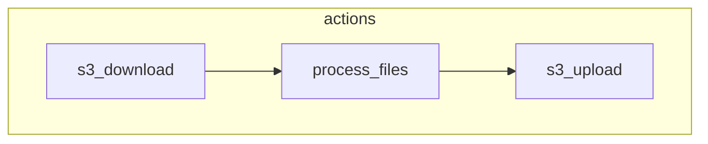

# MLCP

## Introduction

In Masslaw, probably the biggest design requirement is to process users' uploaded content
and extract information from it.
The functionality and logic of these operations are implemented in our MLCP application -
**M**ass**L**aw **C**ontent **P**rocessing.

The application is a standalone machine, that can receive a series of instructions - called
actions, from an external source and execute them one by one.

The MLCP implements the ability to perform text extraction processing on a variety of file types;
The ability to process text from a variety of sources; and plenty of other tasks of both low and
very high complexity - used to perform the processing operations we needed to perform on content
uploaded to our services.

## Usage

The MLCP is a smart-dumb machine, by how it is designed to do very smart things, yet, has to be
told what to do in order to actually execute entire jobs.

The MLCP implements the ability to perform individual actions. An action - is the smallest
operation the MLCP is designed to do. Each individual action is executed independently and does
not depend on the execution of another. However, in some, probably most cases, multiple actions
are executed in some order one by one, where one does depend on the execution of the other. For
example, this series of actions: `download a file --> process it --> upload the result`; In this very
simple example, each process depends on the execution of the one previous to it to function
correctly, though, at the single action level, each process has its own execution and logic and
is not designed exclusively to be executed after one or some set of specific actions - the “process
file” action doesn’t “know” or “require” that the files are downloaded using the “download files”
action, they can very well be created for example, and the “upload file” action doesn’t know that
the target files are the result of the file processing action etc…

### MLCP Process Configuration

The MLCP parses some configuration data, the **mlcp-process-configuration**, which specifies exactly
what to do and how. The **mlcp-process-configuration** is a JSON object provided to the MLCP in multiple
ways (normally as a serialized JSON expression in the container’s environment variables).
The **mlcp-process-configuration** specifies the set of actions the MLCP should perform (as well as
other stuff) most actions also require parameters, these are also specified in the **mlcp-process-configuration**.

#### Structure

The **mlcp-process-configuration** is a JSON object, with a field `“actions“` which is an array of
objects, each object represents an action to perform, and contains the following fields:

- `“name“` - the name of the action to perform - this has to be a specific value, to know more about what names are
  valid, read the [Actions](src/execution_layer/actions/actions.md) implementation documentation.
- `“params“` - an object containing the parameters the action requires to perform its task, the parameters
  are different for each action, to know more about what parameters are required for each action, read the
  [Actions](src/execution_layer/actions/actions.md) implementation documentation. For each action, the parameters
  and their structure are declared in the action implementation and specified in the action’s documentation.
- `“required“` - specifies whether it is crucial that the action's execution is terminated with a successful result.
  If an action's `“required“` property is set to `true`, if the action's execution fails, the entire execution of the
  mlcp application will be terminated with an error, and the execution will not continue to the next action.

A **mlcp-process-configuration** JSON for example:

```json
{
  "actions": [
    {
      "name": "s3_download",
      "params": {
        "bucket": "raw-files-bucket",
        "files_data": [
          {
            "key": "SomeFile.file",
            "save_as": "ToProcess.file"
          },
          {
            "key": "SomeOtherFile.document",
            "save_as": "ImAFile.file"
          }
        ]
      },
      "required": true
    },
    {
      "name": "process_files",
      "params": {
        "files_data": [
          {
            "file_name": "ToProcess.file",
            "text_export_directory": "ExportedText/",
            "assets_export_directory": "ExportedAssets/"
          }
        ]
      },
      "required": true
    },
    {
      "name": "s3_upload",
      "params": {
        "bucket_name": "output-files-bucket",
        "files_data": [
          {
            "saved_as": "ExportedText",
            "key": "exported_text"
          },
          {
            "saved_as": "ExportedAssets",
            "key": "exported_assets"
          }
        ]
      },
      "required": true
    }
  ]
}
```

In this **mlcp-process-configuration** example, the MLCP is instructed to do the following actions:

- **s3_download** - Download files from S3
  This action is used to download one or more files from an S3 bucket, to the storage of the local
  machine on which the MLCP is currently running on.
  In the action configuration, the parameter `“bucket_name“` is specified, and equals: `“raw-files-bucket“` - this is
  the bucket from which files are downloaded as part of this action. The parameter `“files_data“` is also
  specified and is set to be an array of objects, each containing two fields `“key“` and `“save_as“`. Each
  object in the array represents a single file or folder to download from the specified bucket. The `“key“`
  property specifies the key of the file in the S3 bucket, and the `“save_as“` property, specifies the name
  of the file the downloaded file data will be saved to.

- **process_files** - Process one or more files
  This action is used to run a processing task on one or more files saved on the local machine on which
  the MLCP is currently running on. In this case, this is specifically one of the files we just downloaded
  in the previous action and saved locally as `“ToProcess.file“`.
  In the action configuration, the parameter `“files_data“` is specified and is set to be an array of objects,
  each containing the field `“name“` which specifies the name of each file to process as well as the others
  such as `“text_export_directory“` and `“assets_export_directory“` which specify a custom directory (different
  than the default value - the local directory) to export the processing results - the textual data, and the
  assets.

- **s3_upload** - Upload files to S3
  This action is used to upload one or more files to an S3 bucket, from the storage of local the machine
  on - which the MLCP is currently running on.
  In the action configuration, the parameter `“bucket_name“` is specified, and equals: `“output-files-bucket“` - this
  is the bucket to which the files are uploaded as part of this action. The parameter `“files_data“` is also specified
  and is set to be an array of objects, each containing two fields `“saved_as“` and `“key“`. Each object in the
  array represents a single file or folder to upload to the specified bucket. The `“key“` property specifies the
  key of the file in the S3 bucket, and the `“save_as“` property, specifies the name of the file to upload from
  the local storage of the machine the MLCP is currently running on.



This is just a brief example, though, it is very similar to the configuration of the actual job that processes
the raw files uploaded to Masslaw as the first stage of the file-processing pipeline.
This should demonstrate the main idea behind the way an MLCP task is initiated, and how the mlcp-process-configuration
allows for creating or changing MLCP process tasks very easily without requiring support from the software of
the MLCP itself.

----

### To dive deeper, read [MLCP Implementation](src/mlcp_implementation.md)
