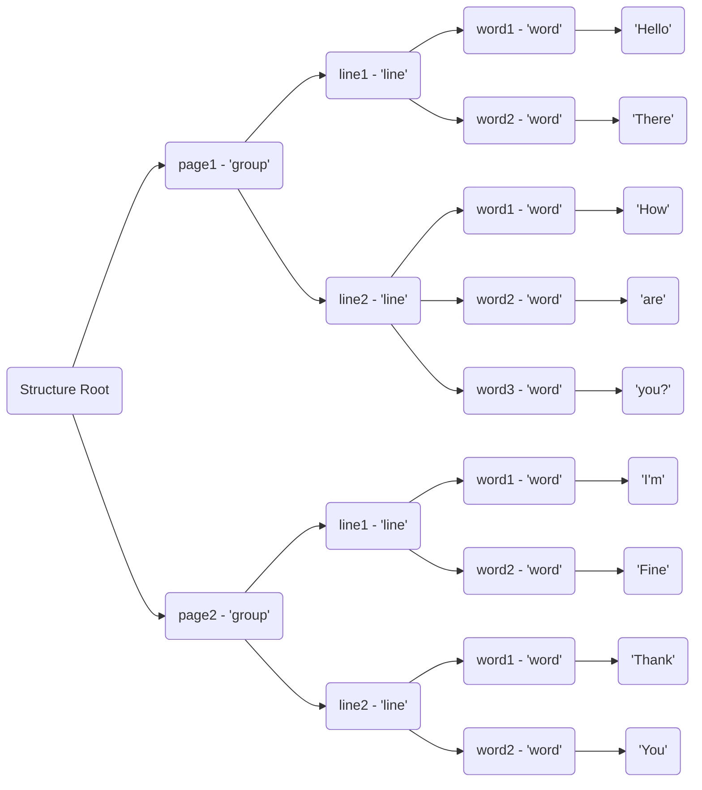

# Extracted Optical Text Structure

This component is responsible for handling the textual content extracted from an optical document or image. It acts as a
convenient place to load all textual data extracted from an optical document, regardless of the actual tool that was used
to extract it, and exposes functionality to very easily construct it, manipulate it, export/load it etc...

---

## Architecture and Design

The Extracted Optical Text Structure component is used to manage and manipulate the data extracted from an optical file
(i.e. document, image etc...).

### Requirements

- The *extracted optical text structure component* is required to be able to load and handle the textual content extracted from
  an optical file or document.

- The *extracted optical text structure component* is required to be able to build a hierarchical structure of the textual
  content extracted from an optical file or document.

- The *extracted optical text structure component* is required to implement logic for exporting the data it handles in
  formats that can then be read and used in other systems.

### Responsibilities

- The *extracted optical text structure component* is responsible for handling the textual content extracted from an optical
  file or document.

- The *extracted optical text structure component* is responsible for being the mediator between the raw data the MLCP 
  extracts from an optical file or document and the rest of the MLCP's functionalities.

## Features

Some of the features the *extracted optical text structure component* are:

- **text structure construction** - the *extracted optical text structure component* implements the logic needed to build a
  hierarchical structure of the textual content extracted from an optical file or document.

- **data exporting** - the *extracted optical text structure component* implements the logic needed to export
  all the data it collected on an optical file or document in formats that can then be read and used in other systems.

- **text structure manipulation** - the *extracted optical text structure component* implements the logic needed to
  manipulate the textual data and structure it holds.

## Implementation

### Interface

In the high-level, the *extracted optical text structure component* exposes functionality used to handle
data extracted from an optical file or document.

#### Extracted Optical Text Document

The data the *extracted optical text structure component* handles is represented by the `ExtractedOpticalTextDocument`
which both holds the textual data and metadata about the document.

#### Optical Element Raw Data Entry

This type of data is used to represent the raw data of an optical element, at the lowest level possible.
Instances of these entries are what's being submitted to the *extracted optical text structure* component to construct
the textual data structure of a document.

### Internal Structure And Implementation

#### General Data Structures
##### Element Structure
This component, mainly focuses on building and managing the structural hierarchy of textual elements in optical files
(i.e. documents, images etc...). 
The textual hierarchy is described by a hierarchy of elements of certain types, each with its own properties and list
of children.

Each element holds information about how its children's values are concatenated together to form its own value. 
This information is stored at the element's `child separator` property.
For example: 
- a `line` element, will have a child separator of `' '`, meaning that the value of the line element is
the concatenation of is children values, separated by a space.
- a `word` element, will have a child separator of `''`, meaning that the value of the word element is
the concatenation of is children values, without any separation.
- a `group` element, will have a child separator of `'\n'`, meaning that the value of the page element is
the concatenation of is children values, separated by a new line.

The leaf objects (the last elements in the hierarchy), will always have a list of string elements as children. They are
also required to be holding a bounding rectangle that describes their location and size on the page.

The bounding rectangles higher on the hierarchy are the bounding rectangles wrapping those of their children.

##### Hierarchy Root
The element hierarchy has a root, which is the absolute father of all elements in it.
The hierarchy root, requires a 'hierarchy formation' to be provided on its creation - the hierarchy root is defined by 
the hierarchy formation.

A hierarchy formation is a list of element types that describe which type of element can exist at each level of the
hierarchy. 
The first element of the list will be the type of children the root has, the second element of the list will be the type
of children that these child elements will have and so on...
As described, essentially each hierarchy formation list, ends with a "str" type (behind the scenes).

For example - the following document:
```text
# page 1
Hello There
How are you?
```
```text
# page 2
I'm Fine
Thank You
```

When described with the hierarchy formation: `[page, line, word]`, it will be represented by the following hierarchy:


##### Extracted Optical Text Document
The object which this component revolves around is the `ExtractedOpticalTextDocument` object. It is the main object
that the component exposes and operates on.

A text document holds a single hierarchy root, that holds the element hierarchy inside of it.
The text document also holds other information other than the textual structure of its content. For example, the
document instance, holds metadata about the document/file it represents - for example, we might want to store the sizes
of each page in the document, or the number of pages in it, or the file name of the document etc...

#### Component Structure
The component implements the [data-structures](#general-data-structures) described above as useable elements in the code

To operate on these elements, the component implements public sub components, that each expose different functionality
used to manage, handle, and operate on these elements.

##### Public Components:

- [Structure Construction](./structure_construction/structure_construction.md) - this component is used to construct the 
structure a document holds, from a collection of simple entries, each representing the lowest level textual and visual 
- data of a single text element in the component.

- [Structure Manipulation](./structure_manipulation/structure_manipulation.md) - this component is used to manipulate 
the structure of a document, by adding, removing, sorting, merging, cleaning etc... elements in an already constructed 
structure.

- [Document Metadata](./document_metadata/document_metadata.md) - this component is used to manipulate the metadata of a
document. It allows adding metadata items to a document dynamically, in a structural form, allowing to not only add 
data, but sorting in a structure that describes it.

- [Document Exporting](./document_exporting/document_exporting.md) - this component is used to export the information 
stored in a document to multiple formats. For example, the data of a document can be exported to an xml file that can 
then be submitted to and read by other systems.

- [Structure Visualizer](structure_visualizing/structure_visualizing.md) - this component is used to visualize the 
structure of a document. For example, it can be used to draw the bounding rectangles of each of the elements on a page
loaded to a document, in the image that visualizes this page.
