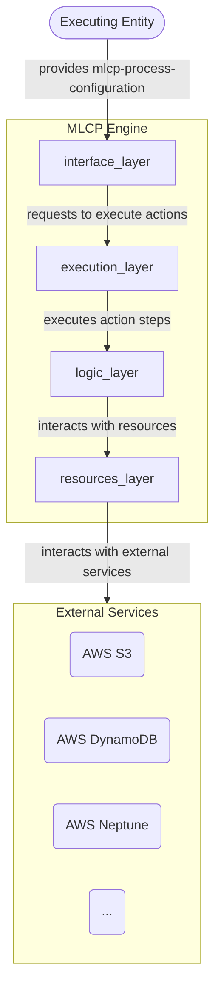
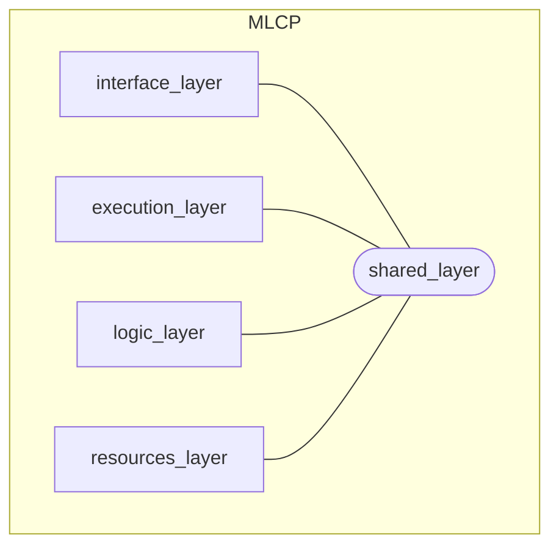

# MLCP Implementation

Before reading about the implementation of the MLCP, make sure you've read the [MLCP Engine Documentation](../mlcp.md)
To have a better understanding of the MLCP high level ideas, its purpose, its usage, and
the role it takes in MassLaw's content processing pipeline.

## Development and Deployment

The MLCP is built as a [Docker image](../dockerfile) and [deployed](../deploy/deploy.bash) to [AWS ECR](https://aws.amazon.com/ecr/).
The application is executed inside a container, running as a job in [AWS Batch](https://aws.amazon.com/batch/).

The MLCP is written in [Python](https://www.python.org/) and utilizes some powerful **external libraries** that exist in
the Python ecosystem such as:

- [NumPy](https://numpy.org/) - a powerful library that adds support for large, multidimensional arrays and matrices,
  along with a collection of mathematical functions to operate on these arrays.
- [OpenCV](https://opencv.org/) - another powerful tool, originally developed for C++, It is an open-source computer
  vision and machine learning library that provides a wide variety of tools and functionalities to build computer vision
  applications such as object detection, face recognition, and many others in Python and other programming languages.
- [TesseractOCR](https://github.com/tesseract-ocr/tesseract) - a Python binding for Google's Tesseract-OCR Engine,
  It is a tool used to extract text from images, making it possible to convert scanned documents and photos into
  editable
  and searchable text, which is essential for applications like document digitization, automatic number plate
  recognition,
  and optical character recognition in images and real-time videos.
- [SpaCy](https://spacy.io/) - a fast and efficient natural language processing (NLP) library, is designed to be
  production-ready and to help you build applications that can process and understand large volumes of text, providing
  functionalities such as tokenization, part-of-speech tagging, named entity recognition, dependency parsing, and more,
  which are essential for various language processing tasks in applications like chatbots, language translation, and
  text summarization.

The MLCP implements some **internal components**, each containing its own purpose and functionality:

- [Extracted Optical Text Structure](src/logic_layer/_text_structures/extracted_text_structure.md) - This component is
  used to handle the complex and hierarchical structure of text elements extracted from an optical document or image.
  It acts as a convenient place to load all textual data extracted from an optical document, regardless of the actual
  tool that was used to extract it, and exposes functionality to very easily manipulate it to get the best out of it.
  This component implements complex logic and algorithms to manipulate and handle optical-textual data - including:
  building a hierarchy of elements out of plain text elements; identifying lines of text, paragraphs, and arrangements
  that indicate the reading order of individual elements; handling bi-directional text, correcting ocr mistakes; and
  many more… This component is also responsible for exporting the data loaded to it, therefore it is the one that
  implements the protocol with which we save the exported textual data, and the one governing that it stays constant.
- [Textual Knowledge Manager](src/logic_layer/...) - This component is used to both manage and handle real and
  meaningful data extracted from text via NLP. It acts as a convenient place to load all data extracted from the textual
  content of files, regardless of the actual tool that was used to extract it, and exposes functionality to very easily
  manipulate it to get the best out of it. This component implements logic used to handle this data both in relation to
  itself and in relation to data previously extracted from other files whose textual content interacts with it -
  including:identifying connections between extracted textual objects; loading extracted textual objects and their
  connections to a graph database; handling crossovers between new data and old data; interacting with the relevant
  services used to save the data (such as “[Amazon Neptune](https://aws.amazon.com/neptune/)”)

## Architecture and Design

The highest level architecture of the MLCP core is a layered architecture. The code is
technically partitioned into layers, that lay on top of each other, each layer can only
interact with the layers above and below it; Formally, **exposes** its functionality to the
layer **above** it, and **uses** the functionality exposed in the layer **below** it.

The layers are:

- [The Interface Layer](interface_layer/interface_layer.md)
  The "front end" or "entry point" for each execution of the MLCP - This layer manages and handles the runtime
  configurations and is responsible for exposing the MLCP functionality to the executing entity.
- [The Execution Layer](execution_layer/execution_layer.md)
  Implements the high level logic needed to perform the steps needed to execute each of the
  MLCP actions. It exposes the ability to call each action for execution to the interface layer.
- [The Logic Layer](logic_layer/logic_layer.md)
  Implements the code that actually performs any low level computational task needed to perform
  any capability the MLCP may or may not need for any action.
- [The Resources Layer](resources_layer/resources_layer.md)
  The "back end" of the MLCP, this layer implements the interactions with the "outer world", other
  services the MLCP may need access to. It exposes resuable functionality that the logic layer may
  need to interact with other services both on the local machine and on the web.

Here's a diagram that showcases the overall high-level architecture of the MLCP core:

The MLCP also contains a selection of reusable components that may or may not be used by all layers
of the architecture, the [shared_layer](_shared_layer/shared_layer.md) contains all the reusable components
or code that needs to be accessible for all layers and isn't part of the layerd structure of the MLCP.

